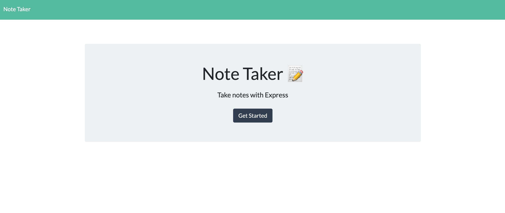
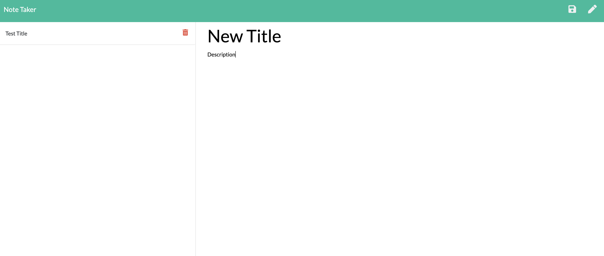
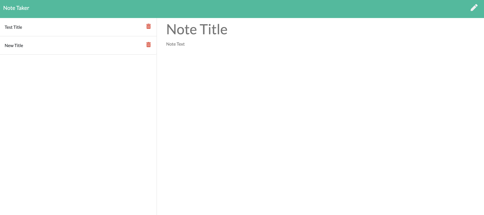

# Note-Taker

## Description

Creates an app to read, write, and delete notes. The objective was to be able to use express to use routes that allow the ability of altering a JSON database of notes. The front end was already created so all I had to do was make the back end match.

## Screenshots

## Installation

The user only needs to run `npm install` if they are running from command line, otherwise it is on the heroku application
https://dashboard.heroku.com/apps/blooming-mesa-46485

## Questions

For any questions, please contact me at:

**Email:** calebhopkins@outlook.com

**GitHub Profile:** [CalebTheCreative]("https://github.com/CalebTheCreative")